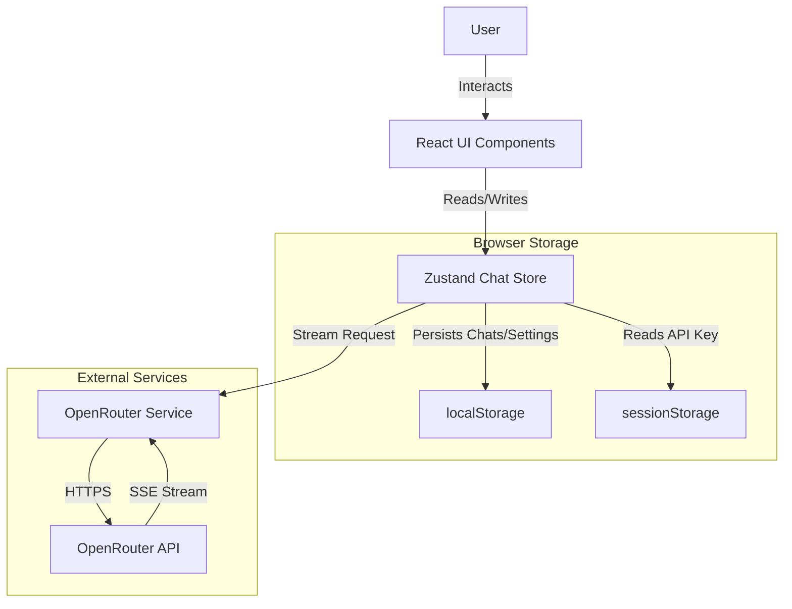
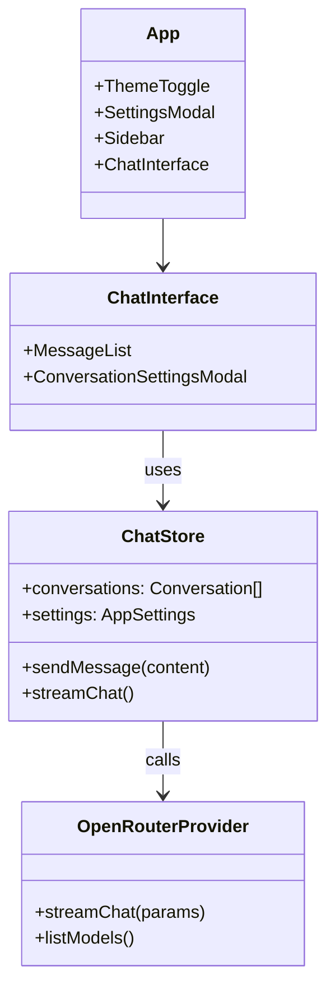

# SoloRouter Chat


A **local-first**, **privacy-focused** chat interface for Large Language Models (LLMs). SoloRouter runs entirely in the browser as a Single Page Application (SPA) with no backend server, connecting directly to [OpenRouter](https://openrouter.ai/) or compatible endpoints.

-----

## 📖 Table of Contents

  - [Overview](#overview)
  - [Key Features](#key-features)
  - [Architecture](#architecture)
  - [Technology Stack](#technology-stack)
  - [Getting Started](#getting-started)
  - [Configuration](#configuration)
  - [Development](#development)
  - [Project Structure](#project-structure)
  - [License](#license)

-----

## Overview

SoloRouter is designed as a "personal text editor for AI chat." It prioritizes user privacy by storing conversation history locally within the browser and maintaining ephemeral API key storage. The application facilitates direct client-to-API communication without intermediate servers.

-----

## Key Features

  * **Local-First Persistence**: Conversations and application settings are stored in the browser's `localStorage`.
  * **Ephemeral Security**: OpenRouter API keys are stored exclusively in `sessionStorage` (cleared on tab close) unless the user explicitly opts for local persistence.
  * **Real-Time Streaming**: Supports Server-Sent Events (SSE) for immediate, token-by-token response display from OpenRouter.
  * **Rich Markdown Support**: Renders responses with GitHub-flavored markdown, syntax highlighting, and sanitized HTML.
  * **Conversation Management**: Create, rename, delete, and switch between multiple conversation threads.
  * **Data Portability**: Full JSON export and import functionality for conversation backups.
  * **PWA Support**: Configured as a Progressive Web App for standalone installation.

-----

## Architecture

SoloRouter operates as a client-only React application. It manages state via Zustand and interfaces directly with external APIs.

### System Architecture



### Component Relationship (Core)



-----

## Technology Stack

Based on the project configuration files:

  * **Runtime Environment**: Browser (Client-side only)
  * **Framework**: React 19
  * **Build Tool**: Vite 7
  * **Language**: TypeScript 5.9
  * **State Management**: Zustand 5
  * **Styling**: Tailwind CSS 3
  * **Markdown Rendering**: `marked` with `dompurify` for sanitization and `highlight.js` for syntax highlighting
  * **Testing**: Vitest

-----

## Getting Started

### Prerequisites

  * **Node.js** 20+
  * **pnpm** (or npm/yarn)

### Installation

1.  **Clone the repository**:

    ```bash
    git clone https://github.com/jacksmack1971/solo-router.git
    cd solo-router
    ```

2.  **Install dependencies**:

    ```bash
    pnpm install
    ```

3.  **Start the development server**:

    ```bash
    pnpm dev
    ```

The application will be accessible at `http://localhost:5173`.

-----

## Configuration

To use the chat capabilities, you must provide an API key.

1.  Open the application settings by clicking the **Settings** icon.
2.  Enter your **OpenRouter API Key**.
      * *Security Note*: By default, keys are saved to `sessionStorage` and cleared when the tab closes. You may optionally choose to "Remember key on this device" to persist it in `localStorage`.
3.  Configure global defaults:
      * **Model**: Select from available OpenRouter models (e.g., `anthropic/claude-3.5-sonnet`).
      * **Temperature**: Adjust response randomness.
      * **System Prompt**: Define the default assistant persona.

-----

## Development

The project uses `pnpm` for script management. Defined scripts in `package.json`:

| Script | Description |
| :--- | :--- |
| `dev` | Starts the Vite development server. |
| `build` | Compiles TypeScript and builds the app for production. |
| `preview` | Previews the production build locally. |
| `lint` | Runs ESLint for code quality checks. |
| `test` | Runs unit tests using Vitest in watch mode. |
| `test:run` | Runs tests once (CI mode). |
| `test:coverage` | Runs tests with coverage reporting. |
| `type-check` | Runs TypeScript type checking without emitting files. |

### Running Tests

The project uses Vitest for testing. To run tests:

1.  **Run tests in watch mode** (automatically re-runs on file changes):
    ```bash
    pnpm test
    ```

2.  **Run tests once** (useful for CI or quick checks):
    ```bash
    pnpm test:run
    ```

3.  **Run tests with coverage**:
    ```bash
    pnpm test:coverage
    ```

    Coverage reports are generated in the `coverage/` directory. The project maintains a minimum coverage threshold of **60%**.

4.  **Run all quality checks** (lint, type-check, and tests):
    ```bash
    pnpm lint && pnpm type-check && pnpm test:coverage
    ```

### Continuous Integration

The project uses GitHub Actions for CI. On every push and pull request, the following checks run:

- ESLint code quality checks
- TypeScript type checking
- Unit tests with coverage
- Coverage threshold validation (must be ≥60%)

The build status is displayed at the top of this README.

-----

## Project Structure

The source code is organized within the `src` directory:

```
src/
├── assets/          # Static assets (SVG, etc.)
├── components/      # React UI components
│   ├── ChatInterface.tsx
│   ├── Markdown.tsx
│   ├── MessageList.tsx
│   ├── SettingsModal.tsx
│   └── ...
├── hooks/           # Custom React hooks (e.g., useTheme)
├── services/        # API interactions (OpenRouter client)
├── store/           # State management (Zustand stores)
├── test/            # Test setup configuration
├── types/           # TypeScript interfaces and types
├── utils/           # Utility functions (Storage, Token counting)
├── App.tsx          # Main application layout
└── main.tsx         # Application entry point
```

-----

## License

This project is licensed under the MIT License.

Copyright (c) 2025 JackSmack1971.

See the [LICENSE](LICENSE) file for details.
