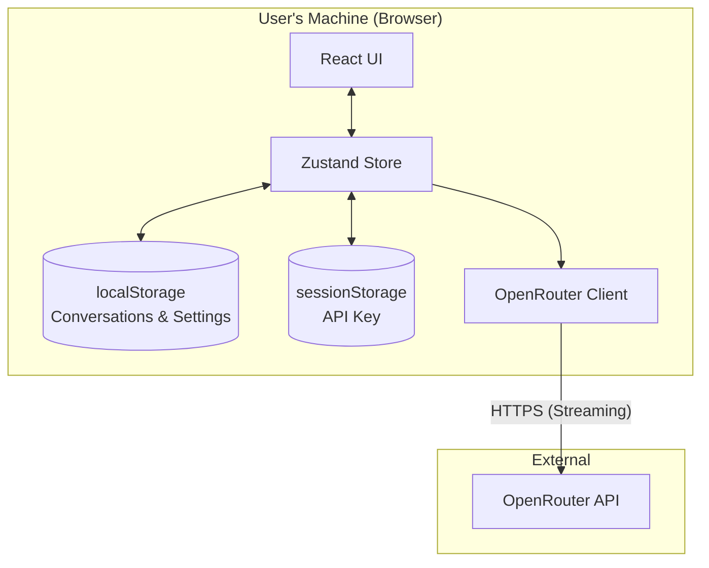

# SoloRouter Chat

**SoloRouter Chat** is a single-user, local-first chat interface for Large Language Models (LLMs), primarily designed for [OpenRouter](https://openrouter.ai/). It runs entirely in your browser with **no backend server**, ensuring that your conversation data remains on your device and your API keys are stored securely in session memory.

> **Vision:** A simple, hackable, and privacy-respecting alternative to SaaS chat apps. Think "nicely built personal text editor, but for AI chat."

-----

## Key Features

Based on the project specification:

  - **🏠 Local-First Architecture**: All conversations and settings are stored in `localStorage`. No database, no cloud sync.
  - **🔒 Privacy-Focused**: Your API key is stored in `sessionStorage` only and never persisted to disk.
  - **⚡ Real-Time Streaming**: Server-Sent Events (SSE) support for immediate response display.
  - **📝 Markdown Support**: Full rendering with syntax highlighting (via `highlight.js`) and DOM sanitization.
  - **⚙️ Model Control**: Configurable model selection, temperature, and system prompts.
  - **📂 Data Management**: Export/Import conversations as JSON for backups.

-----

## Architecture

SoloRouter operates as a purely client-side Single Page Application (SPA). It communicates directly from the user's browser to the OpenRouter API.



### Data Flow

1.  **Chat Interface**: The user inputs a message in `ChatInterface.tsx`.
2.  **State Management**: `chatStore.ts` handles the message and initiates the API request.
3.  **Direct API Call**: `openRouter.ts` sends the request directly to `https://openrouter.ai/api/v1` using the key from `sessionStorage`.
4.  **Persistence**: Conversation history is debounced and saved to `localStorage` via `storage.ts`.

-----

## Quickstart

### Prerequisites

  - **Node.js** (v20+ recommended)
  - **pnpm** (or npm/yarn)
  - An **OpenRouter API Key**

### Installation

1.  **Clone the repository**

    ```bash
    git clone https://github.com/jacksmack1971/solo-router.git
    cd solo-router
    ```

2.  **Install dependencies**

    ```bash
    pnpm install
    ```

3.  **Start the development server**

    ```bash
    pnpm dev
    ```

4.  **Open the app**
    Navigate to `http://localhost:5173` in your browser.

5.  **Configure API Key**
    Click the **Settings** icon and enter your OpenRouter API key. This key is stored only for the current session.

-----

## Project Structure

The codebase is designed to be small and grokkable in under a day.

```text
src/
├── components/      # UI components (ChatInterface, SettingsModal, etc.)
├── hooks/           # Custom React hooks (useTheme)
├── services/        # API clients (OpenRouter implementation)
├── store/           # Zustand state management
├── types/           # TypeScript interfaces
└── utils/           # Helpers for storage and markdown
```

### Core Tech Stack

  - **Framework**: React 19 + Vite 7
  - **Language**: TypeScript 5.9
  - **State**: Zustand 5.0
  - **Styling**: Tailwind CSS 3.4
  - **Markdown**: `marked` + `dompurify` + `highlight.js`

-----

## Configuration & Usage

### Settings

Settings are persisted in `localStorage`:

  - **Default Model**: Choose from models like `anthropic/claude-3.5-sonnet` or `openai/gpt-4o`.
  - **Temperature**: Adjust creativity (0.0 - 2.0).
  - **System Prompt**: Define the AI's persona.

### Security Constraints

  - **No Backend**: There is no intermediate server hiding your API key. It travels directly from your browser to OpenRouter.
  - **Sanitization**: All model output is sanitized via `DOMPurify` to prevent XSS attacks.

-----

## Development

### Scripts

From `package.json`:

  - `pnpm dev`: Start the dev server.
  - `pnpm build`: Type-check and build for production.
  - `pnpm lint`: Run ESLint.

### Guidelines

Refer to the documentation for detailed standards:

  - **`CODING_STANDARDS.md`**: Architecture principles and coding style.
  - **`SPEC.md`**: Functional requirements and specifications.
  - **`CLAUDE.md`**: AI collaboration guide.

-----

## License

Distributed under the MIT License. See `LICENSE` for more information.

-----

### Evidence Appendix

| Context | Source |
| :--- | :--- |
| **Project Name** | `package.json` (name: "solo-router"), `SoloRouter PRD.txt` |
| **Description** | `SoloRouter PRD.txt` , `SPEC.md` |
| **License** | `LICENSE` |
| **Tech Stack** | `package.json` (react, vite, zustand, tailwindcss) |
| **Persistence** | `src/utils/storage.ts` (localStorage/sessionStorage usage) |
| **API Endpoint** | `src/services/openRouter.ts` (OPENROUTER\_BASE\_URL) |
| **Streaming** | `src/services/openRouter.ts` (streamChat implementation) |
| **Sanitization** | `src/components/Markdown.tsx` (DOMPurify usage) |
| **Entry Points** | `index.html`, `src/main.tsx` |
